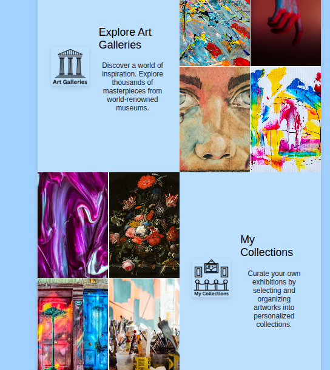
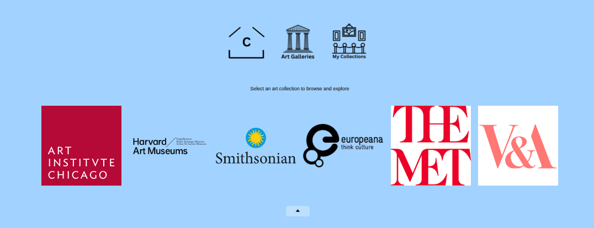

# 🎨 Exhibition Curation Platform

**Exhibition Curation Platform** is a React.js application that allows users to explore artworks from various museums and universities. Users can view their exhibitions and the saved items within each collection. It includes **Firebase Authentication**, integrates with multiple **artworks APIs**, and provides an excellent experience for searching, creating curation collections and saving artworks.
**MVP:**
- Users can search artworks across collections from different museums or Universities APIs. 
- Allow users to browse artworks, from a list view, with "Previous" and "Next" page navigation options to prevent loading of too many items at once.
- Users can filter and/or sort artworks to make navigating the more extensive list of items easier.
- Display images and essential details about each artwork individually.
- Enable users to create, add, and remove items from personal exhibition collections of saved artworks. A single user can have multiple exhibition collections.

---

## Link to the deployed version using Firebase Authentication
[](https://app.netlify.com/sites/curationplatform/deploys)
#### https://curationplatform.netlify.app/

---

## 🚀 Features

- 🔑 **Firebase Authentication** (Google Sign-In, Email/Password)
- 🎭 **Explore artworks** from museums via APIs (Smithsonian, MET, V&A, etc.)
- 📌 **Save artworks** to private collections
- 🔍 **Search functionality** to find specific pieces
- 📤 **Share artworks** on social media
- 🌍 **Accessible** design

---

## 🛠️ Tech Stack

- **Frontend**: React.js (Vite, CSS)
- **Authentication**: Firebase Auth
- **APIs**:  Artic, Europeana, Harvard Art Institute, The Metropolitan Art Museum, Smithsonian, and Victoria and Albert Museum
- **Routing**: React Router

---

## 🔧 Installation & Setup to Run the Project Locally

### 1️⃣ **Clone the repository**

#### git clone https://github.com/CarmenChapi/SE-Exhibition-Curation-Platform-FE.git
https://github.com/CarmenChapi/SE-Exhibition-Curation-Platform-FE.git
And move to the main directory
#### cd app-FE 

### 2️⃣ Install dependencies

npm install

### 3️⃣ Set up Firebase
3️⃣ Set up Firebase Authentication
Your app uses Firebase for user sign‑in (Google + Email/Password). Follow these steps to configure it:

1️⃣ Create a Firebase Project
Go to the Firebase Console and click Add project.
Give it a name (e.g. “Exhibition Curation”) and finish the setup.
2️⃣ Enable Authentication Providers
In your project’s sidebar, select Authentication → Sign‑in method
Enable Google and Email/Password, then save.
3️⃣ Copy Your Firebase Config
In Firebase Console navigate to Project settings → General
Under Your apps, copy the configuration object.
4️⃣ Create src/firebase.js
At the root of your project, create a file named src/firebase.js and paste:

```
import { initializeApp } from "firebase/app";
import {
  browserLocalPersistence,
  createUserWithEmailAndPassword,
  getAuth,
  GoogleAuthProvider,
  setPersistence,
  signInWithEmailAndPassword,
  signInWithPopup,
  signInWithRedirect,
  signOut,
} from "firebase/auth";

const apiKey = import.meta.env.VITE_FIREBASE_API_KEY;
const authDomain =  import.meta.env.VITE_FIREBASE_AUTH_DOMAIN;
const projectId = import.meta.env.VITE_FIREBASE_PROJECT_ID;
const storageBucket = import.meta.env.VITE_FIREBASE_SENDER_ID;
const messagingSenderId =  import.meta.env.VITE_FIREBASE_SENDER_ID;
const appId = import.meta.env.VITE_FIREBASE_APP_ID;
const measurementId = import.meta.env.VITE_FIREBASE_MEASURE_ID;

const firebaseConfig = {
  apiKey: apiKey,
  authDomain: authDomain,
  projectId: projectId,
  storageBucket: storageBucket,
  messagingSenderId: messagingSenderId,
  appId: appId,
  measurementId: measurementId
};


const app = initializeApp(firebaseConfig);
const auth = getAuth(app);
setPersistence(auth, browserLocalPersistence).catch((error) => {
  console.error("Firebase auth persistence could not be enabled:", error);
});
const provider = new GoogleAuthProvider();

export { auth, provider, signInWithPopup, signOut, createUserWithEmailAndPassword,
  signInWithEmailAndPassword, signInWithRedirect };
```


🔒 Put  **.env** in **.gitignore** file to no be committed

5️⃣ Add Environment Variables
Create a file called .env in your project root and populate it with the values from your Firebase config:

```   
VITE_FIREBASE_API_KEY="YOUR_API_KEY"
VITE_FIREBASE_AUTH_DOMAIN="your-project.firebaseapp.com"
VITE_FIREBASE_PROJECT_ID="your-project-id"
VITE_FIREBASE_STORAGE_BUCKET="your-project.appspot.com"
VITE_FIREBASE_SENDER_ID="1234567890"
VITE_FIREBASE_APP_ID="1:1234567890:web:abcdef123456"
VITE_FIREBASE_MEASUREMENT_ID="G-XXXXXXXXXX"

```

### 4️⃣ Set up API Keys
Get API keys from the museum APIs and add them to .env:

- Environment variable to add in .env:
#### VITE_API_KEY_SMITHSONIAN="ApikeyValue"
- ApiInfo: 
#### https://github.com/Smithsonian/OpenAccess
- KeyRequest: 
#### https://api.data.gov/signup/

- Environment variable:
#### VITE_API_KEY_EUROPEANA="ApikeyValue"
- ApiInfo: 
#### https://europeana.atlassian.net/wiki/spaces/EF/pages/2462351393/Accessing+the+APIs
- KeyRequest: 
#### https://pro.europeana.eu/pages/get-api

- Environment variable:
#### VITE_API_KEY_HARVARD="ApikeyValue"
- ApiInfo: 
#### https://github.com/harvardartmuseums/api-docs
- KeyRequest: 
#### https://docs.google.com/forms/d/e/1FAIpQLSfkmEBqH76HLMMiCC-GPPnhcvHC9aJS86E32dOd0Z8MpY2rvQ/viewform**


Add in .gitignore file:
#### .env

### 5️⃣ Run the project

#### npm run dev
The app will be available at http://localhost:5173/.

---

## Node version required
v>=18.0.0

## Backend & Authentication

This project uses **Firebase Authentication** to manage user login. Users can sign in using either:

- Google Sign-In
- Email and password authentication

Firebase handles the authentication process securely and provides the user information needed to identify each logged-in user.

The app also includes a custom backend built with **JavaScript, PostgreSQL, Node.js, Vitest and Express**, deployed on **Supabase and Render**. 

The backend provides API endpoints CRUD (Create, Read, Update, Delete) operations for collections and artwork saved by a specific user.


## Link to the BackEnd Part of the project
- https://se-curator-be.onrender.com/api
- https://github.com/CarmenChapi/SE-ExhibitionCurationP-BE.git

## Technical Challenges


A key challenge was implementing authentication with **Firebase**, including both Google Sign-In and email/password login. I also had to handle different authentication flows and user interactions across desktop and mobile devices.
![alt text][def]

Another major challenge was working with **six different museum APIs**. Each API had a different response structure, so I created logic to extract and standardise the key artwork data, such as title, artist, image, and description.


I also spent time deciding how to display the user’s private collections in a clear and intuitive way. This included organising collections, showing saved artworks, and creating a user-friendly flow for adding and managing artworks.

## Link to a video
https://youtube.com/shorts/i8MpB6xUJkQ


[def]: image.png

## Future Improvements

- Restore the Rijksmuseum integration after resolving its API compatibility issues.
- Add Apple Sign-In to provide more authentication options for users on Apple devices.
- Further modularise the museum API logic to make the code easier to maintain and extend.
- Store more detailed artwork information in users saved collections, such as date, museum source, artwork URL, etc.